# Protecting VMs

## 1. Introduction

In this exercise...

## 2. Creating a VM

1. In the ***OpenShift Console***, select the ***Project*** menu and click ***Create Project***.

    

1. Specify `kasten-lab` as the ***Name*** and click ***Create***.

1. Select ***Virtualization → Virtual Machines*** from the sidebar, and click ***Create VirtualMachine*** in the `kasten-lab` Project.

    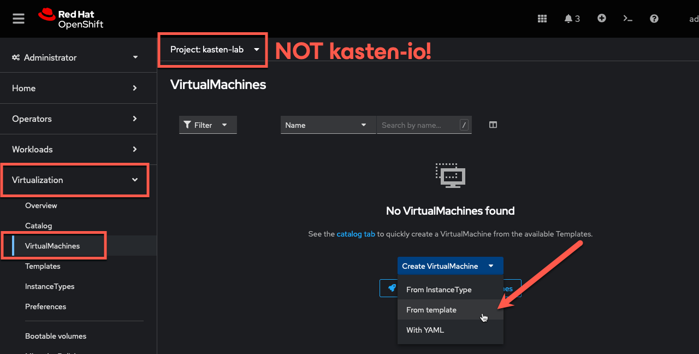

1. Under ***Template catalog***, select the `fedora-server-small` template.

    

1. Update the ***VirtualMachine name*** to `fedora-k10` and click ***Quick create VirtualMachine***.

    

    > [!IMPORTANT]
    >
    > This will provision the VM with preferred storage settings for the default `ocs-storagecluster-ceph-rbd` StorageClass, specifically ***Block VolumeMode*** to provide the ***ReadWriteMany*** access required to enable live migration.

1. Validate the `fedora-k10` PersistentVolumeClaim configuration from ***Storage → PersistentVolumeClaims*** in the sidebar.

    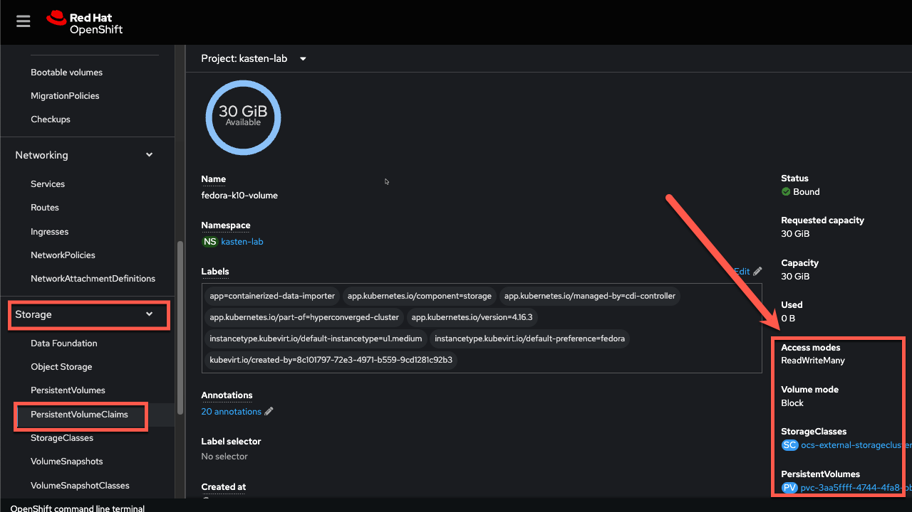

## 3. Enabling Block Mode Exports

> [!IMPORTANT]
>
> As some storage provisioners may not fully support Block volume mode, StorageClasses should first be evaluated for compatibility [using the primer script](https://docs.kasten.io/latest/operating/k10tools.html#k10-primer-block-mount-check). This is skipped in the lab exercise as the `openshift-storage.rbd.csi.ceph.com` provisioner is known to be compatible.

1. In the ***Web Terminal***, run the following to allow the Kasten datamover to export raw Block volumes using the `ocs-storagecluster-ceph-rbd` StorageClass:

    ```bash
    oc annotate storageclass ocs-storagecluster-ceph-rbd \
      k10.kasten.io/sc-supports-block-mode-exports=true
    ```

    > [!NOTE]
    >
    > Ceph RBD native API integration...

## 4. Creating a Kasten Policy

1. In the ***Kasten Dashboard***, select ***Applications*** to view all discovered namespaces.

    

    Your `kasten-lab` application should appear as ***Unmanaged***, indicating it is not being protected by any policy.

    > [!TIP]
    >
    > Namespaces, including the `openshift-...` system namespaces can be excluded from the ***Applications*** list (and compliance reporting) by adding a list of `excludedApps` to the K10 Operand `spec`, as shown:
    >
    > 
    > 
    > The following command can be used to produce a properly formatted list of namespaces beginning with `openshift` that can be copy/paste into the K10 Operand YAML tab:
    >
    > ```bash
    > oc get ns --no-headers=true | awk 'BEGIN { print "  excludedApps:" } /^openshift/{print "    -",$1}'
    > ```

2. Click `kasten-lab` in the ***Applications*** list to view details about the workloads and additional resources discovered within the namespace.

    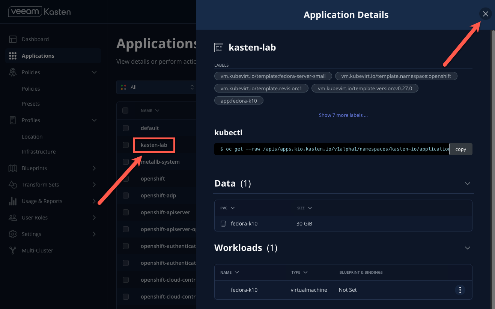

3. Close the ***Application Details*** window.

4. Under `kasten-lab`, select ***... → Create a Policy***.

    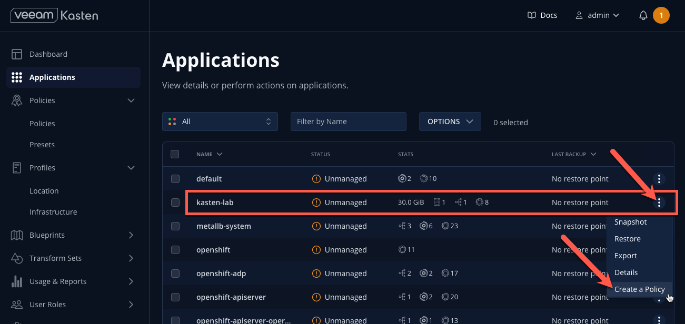

5. Leave the default ***Name*** and ***Action***.

    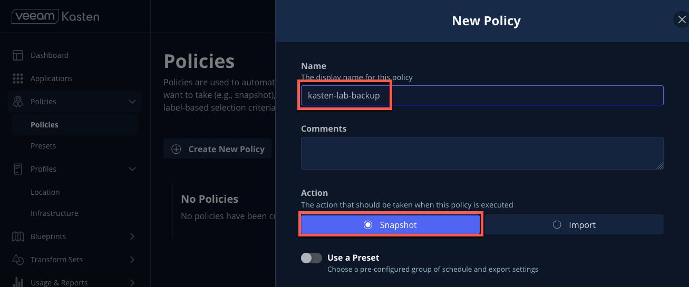

    > [!NOTE]
    >
    > Policy Presets provide the option of allowing administrators to define SLA-focused configurations to simplify self-service data protection for other users.

6. Leave the default ***Hourly Backup Frequency*** and ***Snapshot Retention*** values.

    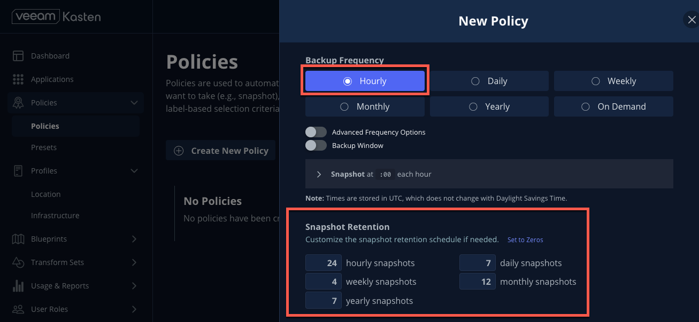

    > [!NOTE]
    >
    > Toggling ***Advanced Frequency Options*** allows users to specify what time hourly snapshots occur, how many snapshots to take per hour, and which snapshots should be used for daily, weekly, monthly, and yearly promotion.
    >
    > Toggling ***Backup Window*** allows users to specify during what times is Kasten allowed to run the policy. Enabling ***Use Staggering*** can intelligently distribute when to start policies during the specified window such that the desired frequency is maintained, but with the least amount of policies running simultaneously, allowing Kasten to reduce the peak load on the cluster.
    >
    > These settings should be left unselected for this lab.

7. Toggle ***Enable Backups via Snapshot Exports*** and select `ceph-rgw-immutable` as the ***Export Location Profile***.

    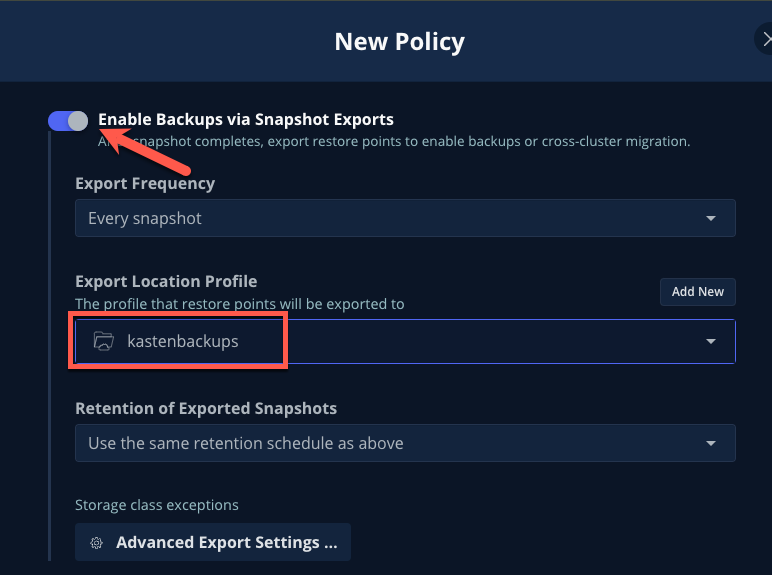

    > [!NOTE]
    >
    > By default, Kasten will export all data associated with the snapshot to ensure you have a durable, off-cluster copy. However, there are circumstances where you may only want to export references to the snapshot, such as migrating a workload in AWS from one availability zone to another. This ability to only export snapshot metadata can dramatically improve performance in these specific instances. This can be configured under ***Advanced Export Settings***.

8. Under ***Select Applications***, verify the `kasten-lab` namespace has been selected.

    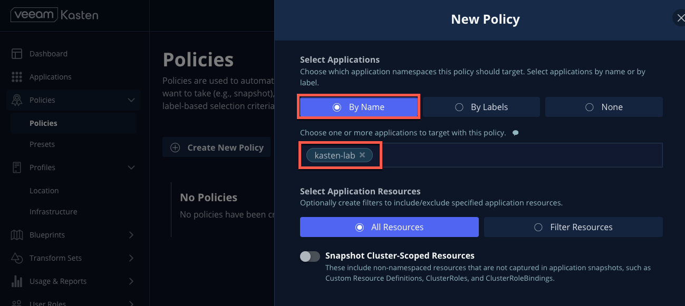

    > [!NOTE]
    >
    > Targeting application(s) based on namespace is generally the most straightforward method of defining a backup policy. However, Kasten also allows you to identify applications based on native Kubernetes labels. This is especially helpful if you want to define "blanket" policies that will apply to current and ***future*** applications, such as `hasData: true` or `backup: gold`.
    >
    > Kasten also provides rich filtering capabilities to include or exclude resources based on Kubernetes ***API Group***, ***API Version***, ***Resource Type***, ***Resource Name***, and ***Labels***. For example, you could exclude backup for ***Secrets*** resources where a label includes an indication that the secret is externally managed.

9. Leave the remaining settings as default.

    > [!TIP]
    >
    > When performing many tasks within the Kasten UI, you can press the ***</> YAML*** button to expose the native Kubernetes YAML that defines the resource created through the UI. This can be useful for familiarizing yourself with the Kubernetes-native APIs defined by Kasten and for extracting snippets for use in GitOps or Infrastructure-as-Code tools.

10. Click ***Create Policy***.

## 5. Freezing the Guest Filesystem

Kasten can freeze the guest filesystem before the snapshot and unfreeze after the snapshot completes by annotating the VirtualMachine resource with `k10.kasten.io/freezeVM=true`.

1. In the ***Web Terminal***, enable filesystem freezing for `fedora-k10`:

    ```bash
    oc annotate virtualmachine fedora-k10 \
      -n kasten-lab \
      k10.kasten.io/freezeVM=true
    ```
    > [!NOTE]
    >
    > The freeze and unfreeze operations will only be attempted if the VirtualMachine is in ***Running*** state.

    > [!WARNING]
    >
    > Kasten defines a 5 minute default timeout for the snapshot operation to complete before aborting the snapshot operation and unfreezing the VM. This can be overridden using the `kubeVirtVMs.snapshot.unfreezeTimeout` Helm/Operand parameter.

## 6. Running the Policy

Rather than wait...

1. In ***Kasten Dashboard → Policies → Policies***, click ***Run Once*** for the `kasten-lab-backup` Policy.

    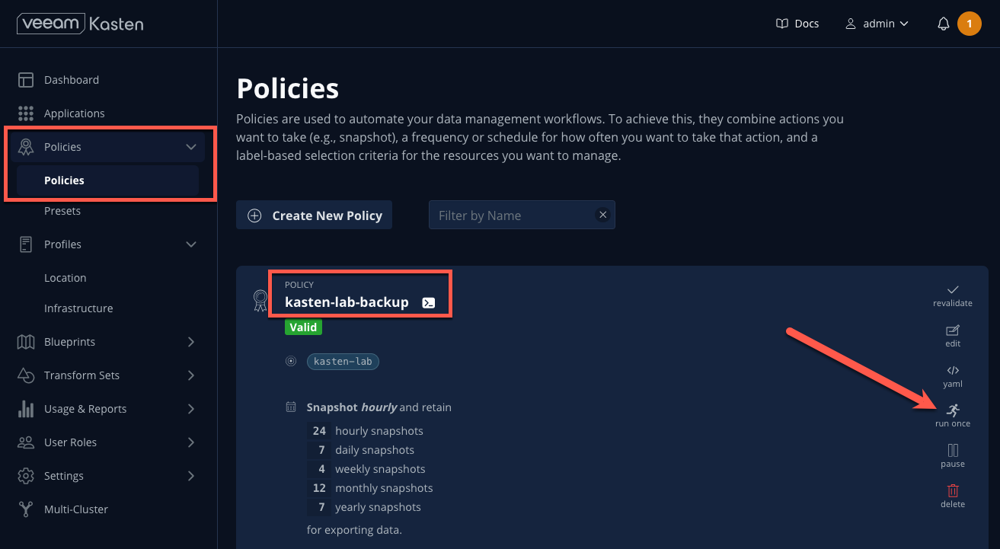

1. Optionally, specify an expiration date for the manual backup and then click ***Yes, Continue*** to start the backup.

    

1. Select ***Dashboard*** from the sidebar.

1. Under ***Actions***, select the `kasten-lab-backup` Policy Run to monitor status.

    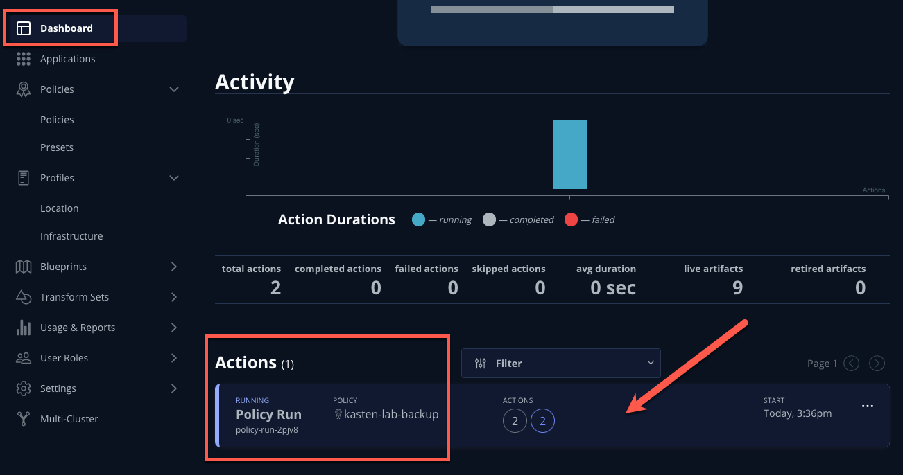

   Click into each individual ***Action*** to view to associated details, including YAML, a complete list of the application metadata and volume snapshots protected, and how much volume data was transferred by the Kasten datamover to the Location Profile.

    

1. Wait for the ***Policy Run*** to complete before proceeding.

    > [!WARNING]
    >
    > If your export failed, ensure you didn't miss step...

## 7. Performing a Local Restore

1. In the ***Kasten Dashboard***, select ***Applications*** from the sidebar.

    You should observe that the `kasten-lab` ***Status*** has changed to ***Compliant***, indicating that...

1.  Under `kasten-lab`, select ***... → Restore***.

    

1. Select the most recent RestorePoint, and click the local version as shown below.
   
    

    You should observe...

1. Keep the default settings and click ***Restore*** to begin a full, in-place restore.
    
    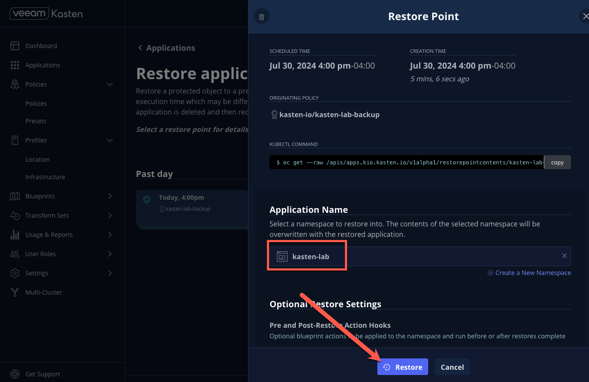

    > [!WARNING]
    >
    > Kasten will terminate the running VM and overwrite the existing resources. However, any resources in the namespace that do not exist in the RestorePoint will not be altered (protecting against unintentional data loss).

1. Return to the ***Dashboard*** to monitor the status of the ***Restore*** under ***Actions***.

    You should expect this operation to complete rapidly, as the VM volume is being restored from a local CSI VolumeSnapshot.

1. Once the ***Restore*** has completed, return to ***OpenShift Console → Virtualization → Virtual Machines*** and validate the `fedora-k10` VM is ***Running***.

    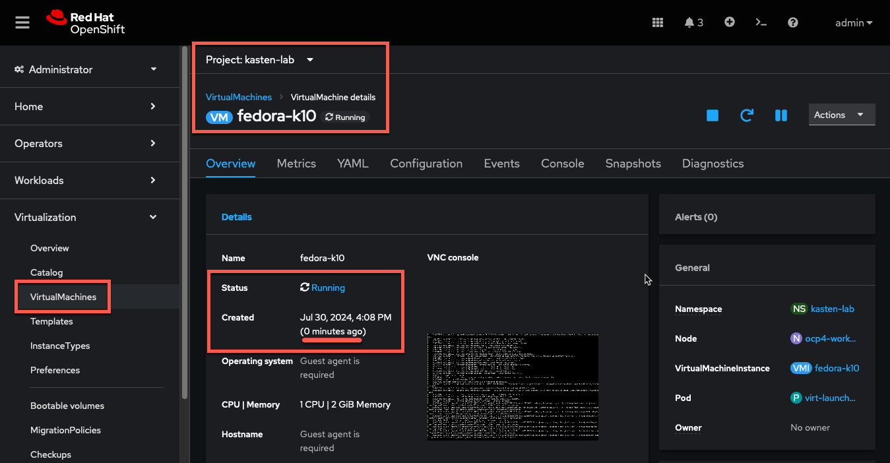

    > [!NOTE]
    >
    > You can also validate the source of the restored volume by running:
    >
    > ```bash
    > oc describe pvc fedora-k10 -n kasten-lab
    > ```
    >
    > You should observe the volume's ***DataSource*** is a `k10-csi-snap-...` VolumeSnapshot.

## 8. Performing a Remote Restore

1. In the ***Web Terminal***, run the following to delete the `kasten-lab` namespace:

    ```bash
    oc delete virtualmachine fedora-k10 -n kasten-lab

    oc delete namespace kasten-lab
    ```

    > [!IMPORTANT]
    >
    > *"Snapshots are not backup."*
    >              ~ Mark Twain
    >
    > VolumeSnapshots are namespaced resources. Removing the `kasten-lab` namespace will delete the VolumeSnapshots associated with your local RestorePoints. Additionally, the `ocs-storagecluster-rbdplugin-snapclass` VolumeSnapshotClass sets `deletionPolicy: Delete` by default, meaning that deletion of the VolumeSnapshot resource results in the removal of the snapshot within Ceph.

1. In the ***Kasten Dashboard***, select ***Applications*** from the sidebar.

1. Click the ***All*** dropdown menu and select ***Removed*** to view the list of non-existent namespaces with available RestorePoints.

    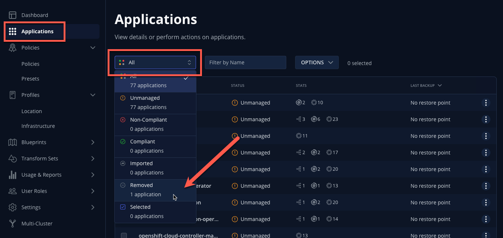

1.  Under `kasten-lab`, select ***... → Restore***.

1. Select the most recent RestorePoint, and click the ***EXPORTED*** version as shown below.
   
    

1. Under ***Application Name***, click ***+ Create New Namespace***.

1. Specify `kasten-lab-clone` as the ***New Namespace*** and click ***Create***.
   
    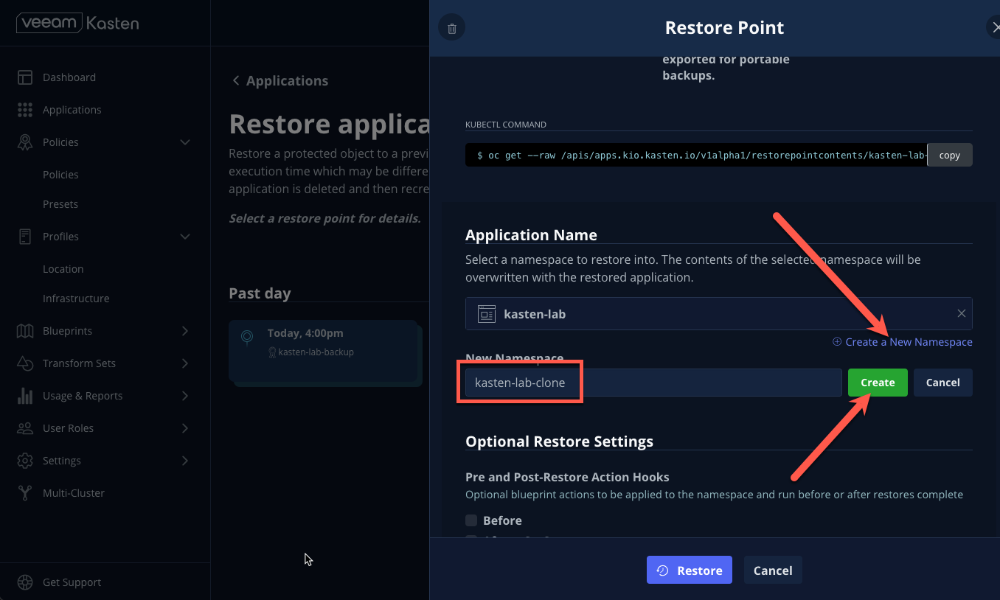

1. Click ***Restore*** and return to the ***Dashboard*** to monitor progress under ***Actions***.

    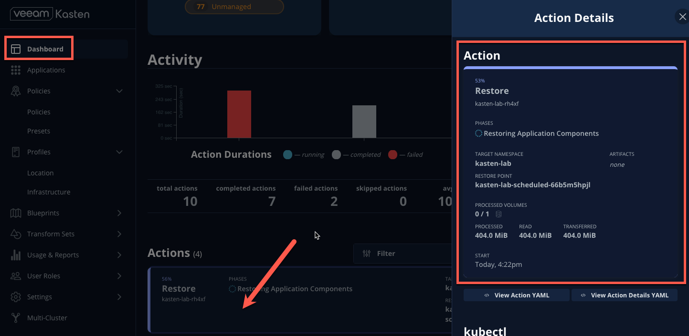

1. Return to ***OpenShift Console → Virtualization → VirtualMachines*** and observe the `fedora-k10` VirtualMachine now running in the `kasten-lab-clone` namespace.

    

    > [!NOTE]
    >
    > Unlike the local restore, the PVC populated by the Kasten datamover will not contain a ***DataSource*** snapshot reference:
    >
    > ```bash
    > oc describe pvc fedora-k10 -n kasten-lab-clone
    > ```

## 9. Takeaways

- Stuff
- And
- Things