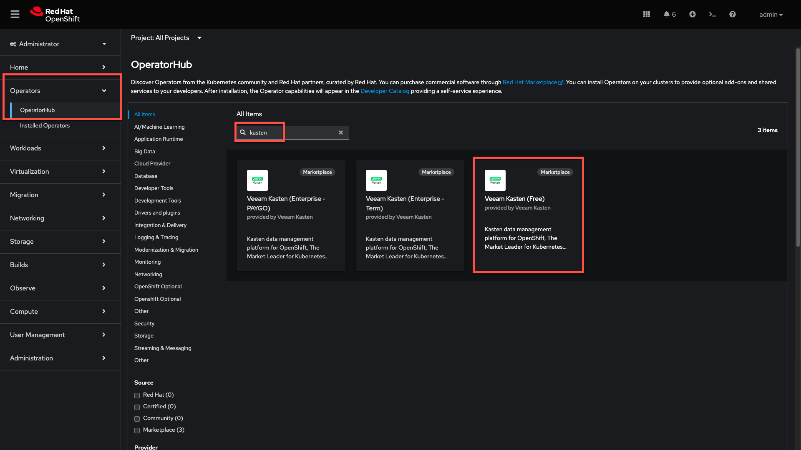
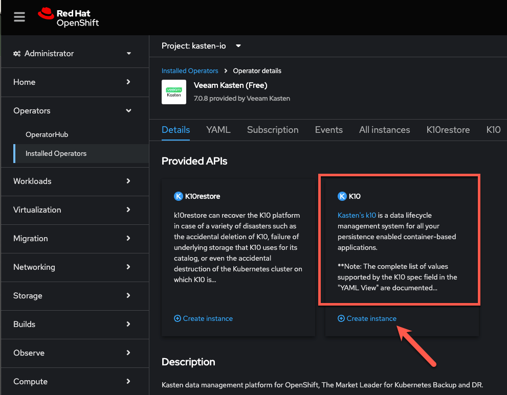

# Installing Veeam Kasten <Badge type="tip" text="v6.5.13" />

## 1. Introduction

This add-on lab guide is intended to familiarize practitioners with the protection of OpenShift Virtualization workloads using ***Veeam Kasten for Kubernetes***. It assumes the learner has completed other ***OpenShift Virtualization Roadshow*** lab exercises and are familiar with virtual machine provisioning and management in OpenShift.

### What is Veeam Kasten?

***Veeam Kasten for Kubernetes*** is a purpose-built data protection solution for Kubernetes that enables organizations to perform backup & restore, disaster recovery, and cross-cluster mobility of their applications.

### How does Kasten work?


1. Kasten is deployed to the cluster that it protects. Within the cluster, Kasten communicates with the Kubernetes API server to discover applications and their resources.
2. Kasten orchestrates point-in-time snapshots of complete applications, including both application manifest data and storage volume data.
3. Kasten exports portable copies of the point-in-time snapshot to an external object, NFS, or Veeam repository.

---

*In the first exercise you will install Veeam Kasten through the OpenShift OperatorHub and access the dashboard user interface via an OpenShift Route.*

## 2. Running Primer Script

1. In the ***OpenShift Console***, open the ***Web Terminal*** and click ***Start*** to initialize the terminal (if prompted).

    

1. In the ***Web Terminal***, run the following to run the Kasten "primer" script to evaluate your target cluster configuration prior to Kasten installation:

    ```bash
    helm repo add kasten https://charts.kasten.io/

    helm repo update

    curl -s https://docs.kasten.io/tools/k10_primer.sh  | bash
    ```

    You should expect to see one or more occurrences of the error below:

    ```
    ...
    At least 1 VolumeSnapshotClass needs the k10.kasten.io/is-snapshot-class annotation set to true. - Error // [!code error]
    ...
    ```

    The `k10.kasten.io/is-snapshot-class` annotation is used by Kasten to determine which VolumeSnapshotClass should be used by Kasten to request CSI snapshots for PersistentVolumes provisioned by a given CSI provider.

1. Run the following to annotate the available VolumeSnapshotClasses and re-run the primer script:

    ```bash
    oc annotate volumesnapshotclass \
      ocs-storagecluster-rbdplugin-snapclass \
      k10.kasten.io/is-snapshot-class=true
    
    oc annotate volumesnapshotclass \
      ocs-storagecluster-cephfsplugin-snapclass \
      k10.kasten.io/is-snapshot-class=true

    curl -s https://docs.kasten.io/tools/k10_primer.sh  | bash
    ```

    The primer should now complete without errors, indicating any common configuration issues have been addressed.

    > [!NOTE]
    >
    > Running the primer script is not required to install Kasten, but is highly recommended.
    >
    > The script can also be used to validate CSI VolumeSnapshot creation and restore capabilities. See [docs.kasten.io](https://docs.kasten.io/latest/install/storage.html#csi-preflight).

1. Close the ***Web Terminal***.

## 3. Installing Kasten

1. In the ***OpenShift Console***, search for `Kasten` in the ***OperatorHub*** and select ***Kasten K10 (Free)***:

    

    > [!NOTE]
    >
    > Alternate versions of the Kasten operator are available for use if transacting Kasten licensing through the Red Hat Marketplace.
    >
    > If desired, Kasten may also be [installed on OpenShift via Helm chart](https://docs.kasten.io/latest/install/openshift/helm.html#helm-based-installation). 

1. Click ***Install***.

1. Click ***Install*** to initiate operator installation using the default settings.

    

1. After operator installation completes, click ***View Operator*** (or select ***Operators → Installed Operators → Kasten K10 (Free)*** from the sidebar).

1. Under ***Provided APIs > K10***, click ***+ Create instance***.

    

1. Under ***Form view***, toggle the following options to ***True***:

    - ***Enable Token Based Authentication***
    - ***Enable K10 dashboard to be exposed via route***
    - ***Create secured edge route for exposing K10***

    

    > [!NOTE]
    >
    > The Kasten installation can be further customized using the YAML view. A complete list of configuration parameters is [available on docs.kasten.io](https://docs.kasten.io/latest/install/advanced.html#complete-list-of-k10-helm-options). 

1. Click ***Create***.

1. From the ***Web Terminal***, run the following to monitor the installation:

    ```bash
    watch oc get pods -n kasten-io
    ```

1. Once all Deployments are ***READY***, press `CTRL+C` to end the `watch`.

    

1. Run the following to obtain the token for the `admin` user currently logged into the OpenShift console and copy the output to the clipboard:

    ```bash
    oc whoami -t
    ```

    > [!NOTE]
    >
    > This token will be used to authenticate to Kasten as your current OpenShift user. In addition to Kubernetes bearer tokens, Kasten also supports authentication using OpenID Connect (OIDC), Active Directory (LDAP), and OpenShift's built-in OAuth server. 

2. Close the ***Web Terminal***.

## 4. Accessing the Kasten Dashboard

1. In the ***OpenShift Console***, select ***Networking → Routes*** from the sidebar and open the `k10-route` Route URL.

    

1. Paste the `admin` token value from the previous exercise and click ***Sign-in***.

    

1. Specify ***Email*** and ***Company name*** values and click ***Accept Terms***.

    

    You should observe that the ***Kasten Dashboard*** is being accessed as your cluster's `admin` user.

    

    > [!NOTE]
    >
    > Kasten ships with multiple built-in user roles, including `k10-admin` and `k10-basic`. As Kasten is built on Kubernetes-native resources, custom roles can be built and bound to users/groups to define fine-grained access on a per namespace level. This helps to allow secure self-service for end users who may need to manage their own policies or restores without dependence on a data protection administrator.