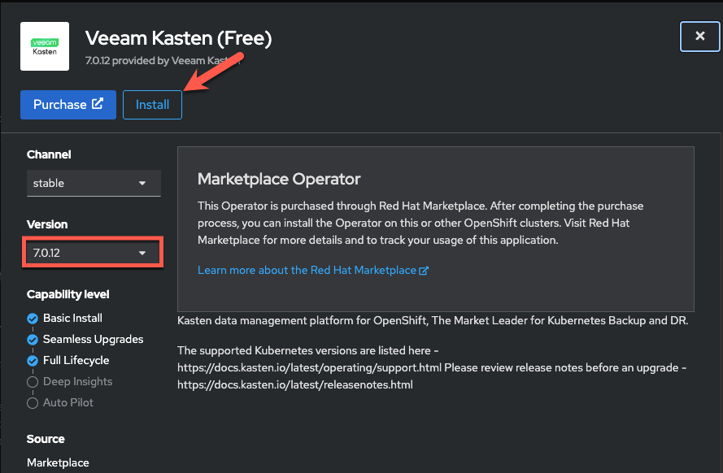
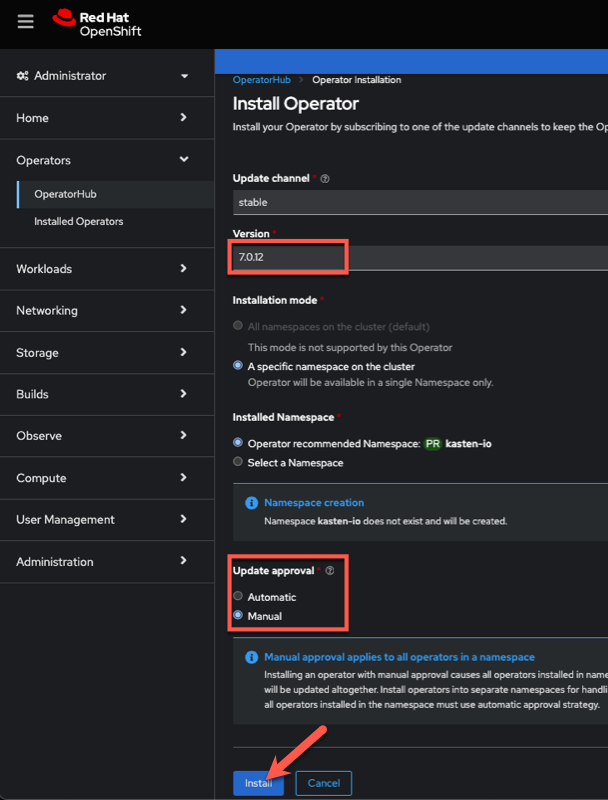
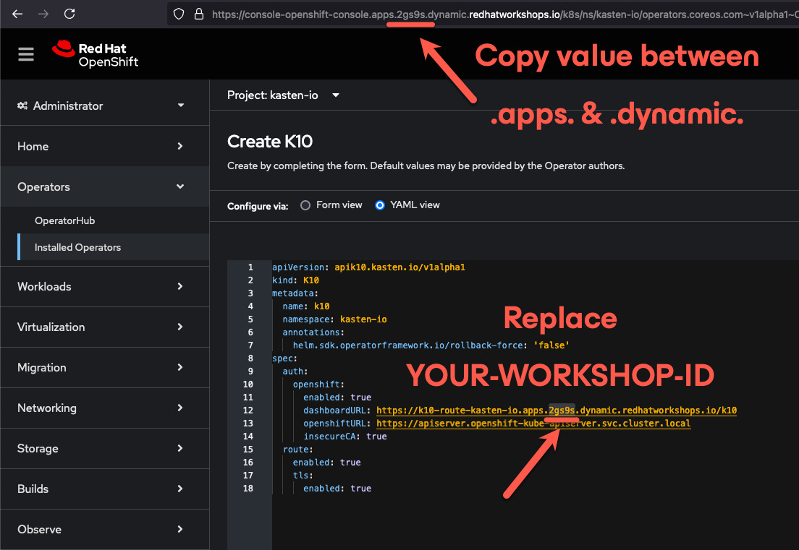

# Installing Veeam Kasten <Badge type="tip" text="v7.0.5" />

## 1. Introduction

This add-on lab guide is intended to familiarize practitioners with the protection of OpenShift Virtualization workloads using ***Veeam Kasten for Kubernetes***. It assumes the learner has completed other ***OpenShift Virtualization Roadshow*** lab exercises and are familiar with virtual machine provisioning and management in OpenShift.

### What is Veeam Kasten?

***Veeam Kasten for Kubernetes*** is a purpose-built data protection solution for Kubernetes that enables organizations to perform backup & restore, disaster recovery, and cross-cluster mobility of their applications.

### How does Kasten work?


1. Kasten is deployed to the cluster that it protects. Within the cluster, Kasten communicates with the Kubernetes API server to discover applications and their resources.
2. Kasten orchestrates point-in-time snapshots of complete applications, including both application manifest data and storage volume data.
3. Kasten exports portable copies of the point-in-time snapshot to an external object, NFS, or Veeam repository.

---

    > [!IMPORTANT]
    >
    > We have pre-staged the lab with an install of Veeam Kasten, so there's no need to complete the steps in Section 2.
    > Rather, this section just highlights how'd you go about installing Kasten if it were not already installed on
    > the OpenShift cluster.


## 2. Installing Kasten

1. In the ***OpenShift Console***, search for `Kasten` in the ***OperatorHub*** and select ***Kasten K10 (Free)***:

    

    > [!NOTE]
    >
    > Alternate versions of the Kasten operator are available for use if transacting Kasten licensing through the Red Hat Marketplace.
    >
    > If desired, Kasten may also be [installed on OpenShift via Helm chart](https://docs.kasten.io/latest/install/openshift/helm.html#helm-based-installation).

1. Under ***Version***, select `7.0.12` from the dropdown menu, and click ***Install***.

    

    > [!IMPORTANT]
    >
    > It's recommended to always run the latest available version of Kasten. Explicitly selecting version `7.0.5` is to ensure consistent instructions and corresponding screenshots in this lab guide.

1. Under ***Update approval*** select ***Manual*** and then click ***Install*** to initiate operator installation.

    

1. When prompted, click ***Approve*** to proceed with operator installation.

    

1. After operator installation completes, click ***View Operator*** (or select ***Operators → Installed Operators → Kasten K10 (Free)*** from the sidebar).

1. Under ***Provided APIs > K10***, click ***+ Create instance***.

    

1. Select ***YAML view*** and overwrite the default options with the configuration below:

    ```yaml
    apiVersion: apik10.kasten.io/v1alpha1
    kind: K10
    metadata:
      name: k10
      namespace: kasten-io
      annotations:
        helm.sdk.operatorframework.io/rollback-force: 'false'
    spec:
      auth:
        openshift:
          enabled: true
          dashboardURL: https://k10-route-kasten-io.apps.YOUR-WORKSHOP-ID.dynamic.redhatworkshops.io/k10
          openshiftURL: https://apiserver.openshift-kube-apiserver.svc.cluster.local
          insecureCA: true
      route:
        enabled: true
        tls:
          enabled: true
    ```

1. Replace `YOUR-WORKSHOP-ID` with the 5 character identifier for your lab environment DNS, as shown in the screenshot below:

    

    This configuration will enable integration with the built-in OpenShift OAuth server and the creation of a `Route` for secure, multi-user access to the Kasten dashboard.

    > [!NOTE]
    >
    > A complete list of configuration parameters is [available on docs.kasten.io](https://docs.kasten.io/latest/install/advanced.html#complete-list-of-k10-helm-options). 

1. Click ***Create***.

1. Open the ***Web Terminal*** and click ***Start*** to initialize the terminal (if prompted).

    

1. From the ***Web Terminal***, run the following to monitor the installation:

    ```bash
    watch oc get pods -n kasten-io
    ```

1. Once all Deployments are `READY`, press `CTRL+C` to end the `watch`.

    

1. As a final deployment step, annotate the available VolumeSnapshotClasses for use with Kasten:

    ```bash
    oc annotate volumesnapshotclass \
      ocs-external-storagecluster-rbdplugin-snapclass  \
      k10.kasten.io/is-snapshot-class=true

    oc annotate volumesnapshotclass \
      ocs-external-storagecluster-cephfsplugin-snapclass \
      k10.kasten.io/is-snapshot-class=true
    ```

    > [!IMPORTANT]
    >
    > The `k10.kasten.io/is-snapshot-class` annotation is used by Kasten to determine which VolumeSnapshotClass should be used by Kasten to request CSI snapshots for PersistentVolumes provisioned by a given CSI provider.

1.  Close the ***Web Terminal***.

## 3. Accessing the Kasten Dashboard

1. In the ***OpenShift Console***, select ***Networking → Routes*** from the sidebar and open the `k10-route` Route URL.

    

    You should be redirected to the OpenShift OAuth login prompt.

1. Use the OpenShift Console `admin` credentials provided as part of your lab environment and click ***Log-in***.

    

1. When prompted, select ***Allow selected permissions*** to allow Kasten read-only access to username and group membership details from the OpenShift OAuth server.

1. Specify your ***Email Address*** and ***Company*** values and click ***Accept Terms***.

    

    You should observe that the ***Kasten Dashboard*** is being accessed as your cluster's `admin` user.

    

    > [!NOTE]
    >
    > Kasten ships with multiple built-in user roles, including `k10-admin` and `k10-basic`. As Kasten is built on Kubernetes-native resources, custom roles can be built and bound to users/groups to define fine-grained access on a per namespace level. This helps to allow secure self-service for end users who may need to manage their own policies or restores without dependence on a data protection administrator.