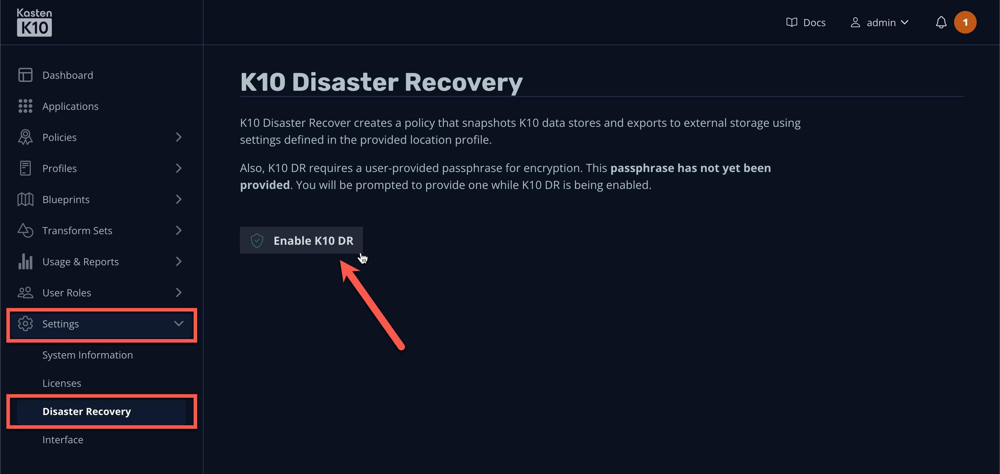
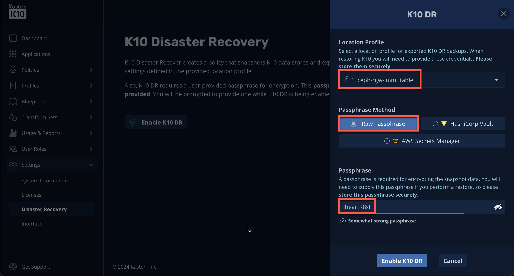
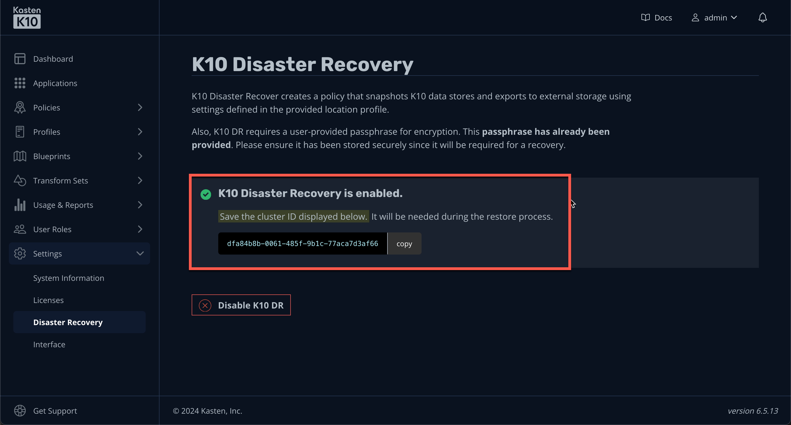
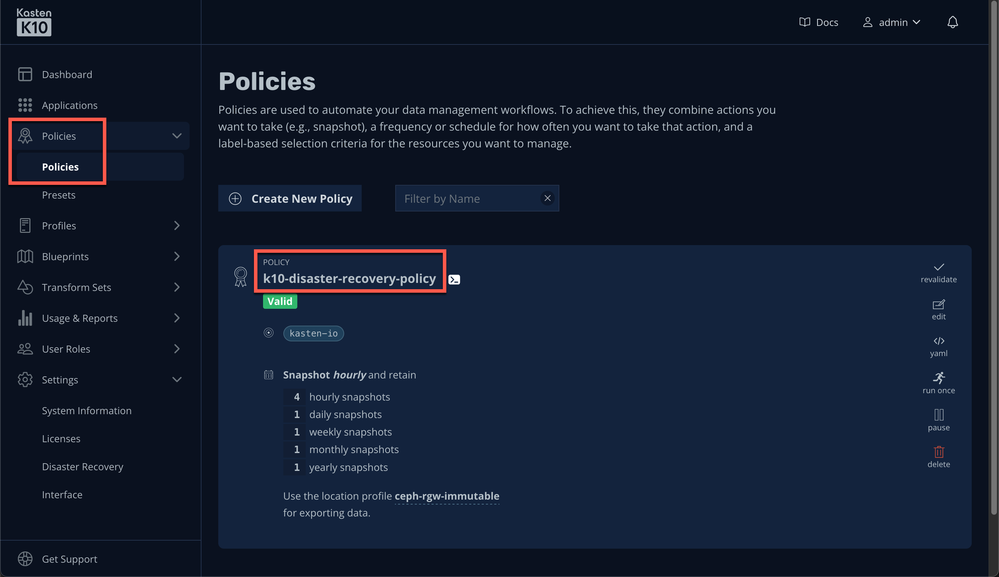

# Enabling K10 DR

## 1. Introduction
In this exercise...

## 2. Enabling K10 DR

1. In the ***Kasten Dashboard***, select ***Settings → Disaster Recovery*** from the sidebar and click ***Enable K10 DR***.

    

1. Fill out the following fields:

    |  |  |
    |---|---|
    | ***Location Profile*** | `ceph-rgw-immutable` |
    | ***Passphrase Method*** | Raw Passphrase |
    | ***Passphrase*** | `iheartK8s!` |

    

    > [!IMPORTANT]
    >
    > Keep it secret, keep it safe - because... 

    > [!NOTE]
    >
    > See [docs.kasten.io](https://docs.kasten.io/latest/operating/dr.html#enabling-k10-disaster-recovery) for details on configuring third-party secret managers with K10 DR.

1. Click ***Enable K10 DR***.

    

    > [!NOTE]
    >
    > The cluster ID corresponds to the `default` Namespace UID, and is used at the root of the Location Profile repository to differentiate between multiple clusters backing up applications to the same bucket.

1. Select ***Policies → Policies*** from the sidebar.

    

    You should observe the `k10-disaster-recovery-policy` Policy has been created to protect the local Kasten configuration and catalog of available backups, allowing you to easily restore in the event of complete cluster loss.

    > [!NOTE]
    >
    > See [docs.kasten.io](https://docs.kasten.io/latest/operating/dr.html#recovering-with-the-operator) for details on performing a K10 DR restore operation through the Operator.