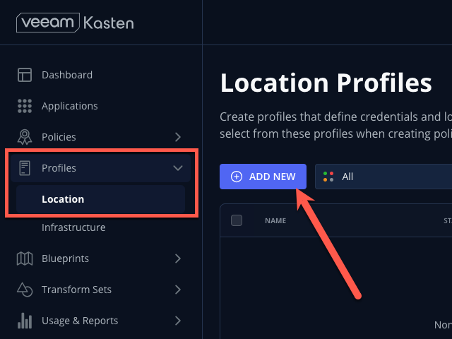
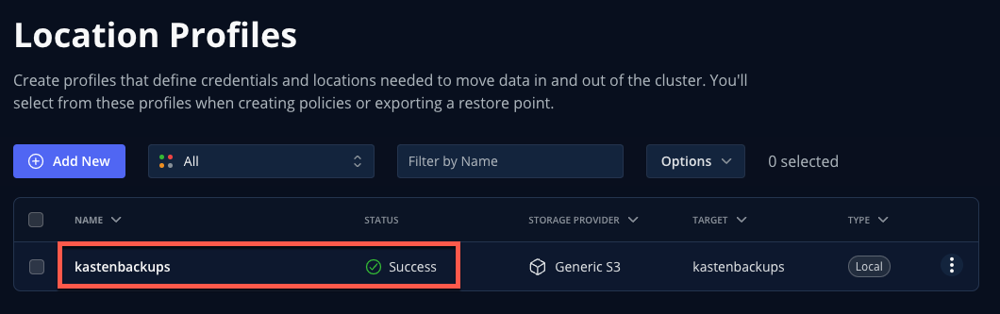
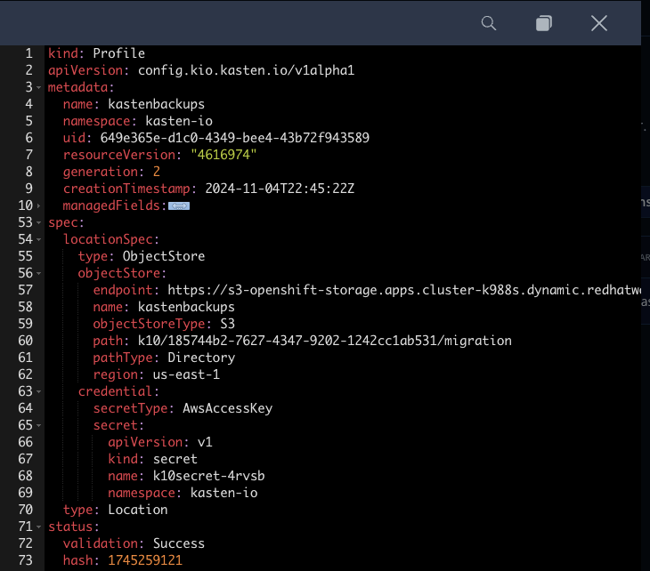

# Configuring Location Profiles

## 1. Introduction

You've now configured everything required to perform a local snapshot of a Kubernetes application using Kasten - *but snapshots are not backup!* In order to restore in the event the local cluster or primary storage is compromised, a copy of that data should be exported to another location.

The configuration of these backup targets are called ***Location Profiles***. Kasten [supports several options](https://docs.kasten.io/latest/usage/configuration.html), including:
  - AWS S3
  - Azure Blob
  - Google Cloud Storage
  - S3-Compatible
  - NFS
  - Veeam Backup & Recovery

Kasten supports the creation of immutable backups to ensure that, as a last line of defense against ransomware, backup data cannot be manipulated or deleted by any user. These backups are supported on the following platforms:
  - AWS S3
  - S3-Compatible with Object Lock support (ex. Ceph, MinIO, Wasabi, etc.)
  - Azure Blob
  - Google Cloud Storage

---

*In this exercise, you will configure an immutable bucket using the on-cluster Ceph Object Gateway deployment and add the bucket as a Location Profile in Kasten.*

> [!CAUTION]
>
> In a real world environment you should never back up data to the same infrastructure you are intending to protect - using on-cluster storage as a backup target is performed in the lab solely to simplify lab staging and instructions. 

## 2. Configuring an Object Bucket Claim to Store Backups

   > [!CAUTION]
   >
   > Kasten supports immutable object storage and it is recommended to protect backups against accidental deletion or ransomware attack.  For this lab, we won't
   configure immutability as it 

1. Open an OpenShift command line terminal

    

1. Run the following command to retrieve the Access Key for the Multicloud Object Gateway:

    ```bash
    oc get secret -n backuptarget kastenbackups -ojsonpath='{.data.AWS_ACCESS_KEY_ID}' | base64 --decode && echo
    ```
    Copy the Access Key to a text editor as it will be needed again shortly


1. Run the following command to retrieve the Secret Key for the Multicloud Object Gateway:

    ```bash
    oc get secret -n backuptarget kastenbackups -ojsonpath='{.data.AWS_SECRET_ACCESS_KEY}' | base64 --decode && echo
    ```
    Copy the Secret Key to a text editor as it will be needed again shortly

2. Run the following command to retrieve the S3 endpoint address

    ```bash
    oc get route s3 -n openshift-storage -ojson | jq -r '.spec.host'
    ```
    Copy the Endpoint Address to a text editor as it will be needed again shortly

## 3. Creating an S3-Compatible Location Profile

1. In the ***Kasten Dashboard***, select ***Profiles → Location*** from the sidebar and click ***+ Add New***.

    

1. Fill out the following fields and click ***Next***:

    |  |  |
    |---|---|
    | ***Location Profile Name*** | `kastenbackups` |
    | ***Storage Provider*** | S3 Compatible |

    

1. Fill out the following fields ***but DO NOT click Next yet!***:

    |  |  |
    |---|---|
    | ***S3 Access Key*** | Paste `ACCESS KEY` value |
    | ***S3 Secret*** | Paste `SECRET KEY` value |
    | ***Endpoint*** | Paste `ENDPOINT` value |
    | ***Region*** | `us-east-1` |
    | ***Bucket*** | `kasten` |

    


1. Click ***Next → Save Profile***.

    You should expect your `ceph-rgw-immutable` Location Profile to appear with a ***Success*** status.

    

    Now you're ready to start protecting apps!

1. Click the ***...*** menu and select ***View YAML*** to view the manifest generated by creating a Location Profile through the Dashboard.

    

    As you can see from this example, Kasten Location Profiles can be created declaratively as a `profile.config.kio.kasten.io` object referencing a Secret to store access and secret keys. This Kubernetes-native implementation makes it simple to configure backup targets using a GitOps approach.

    > [!NOTE]
    >
    > See [docs.kasten.io](https://docs.kasten.io/latest/api/profiles.html) for complete documentation on defining Profile API objects.

1. Click ***Cancel*** or the ***X*** in the upper-right to close the YAML window.