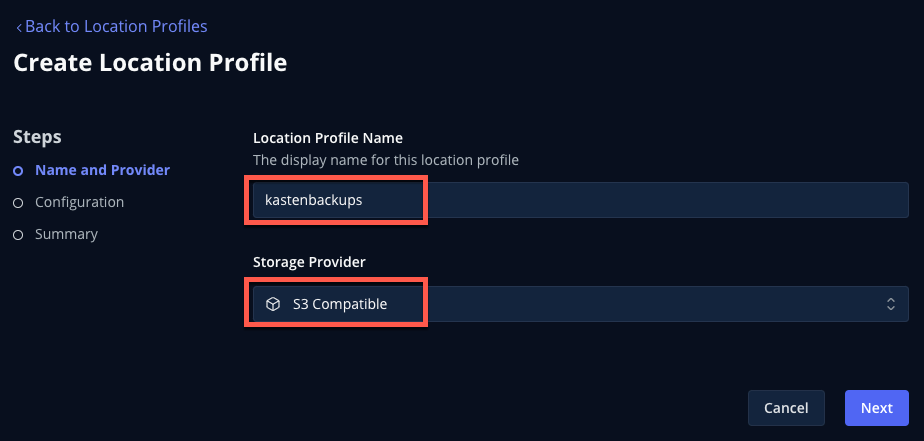
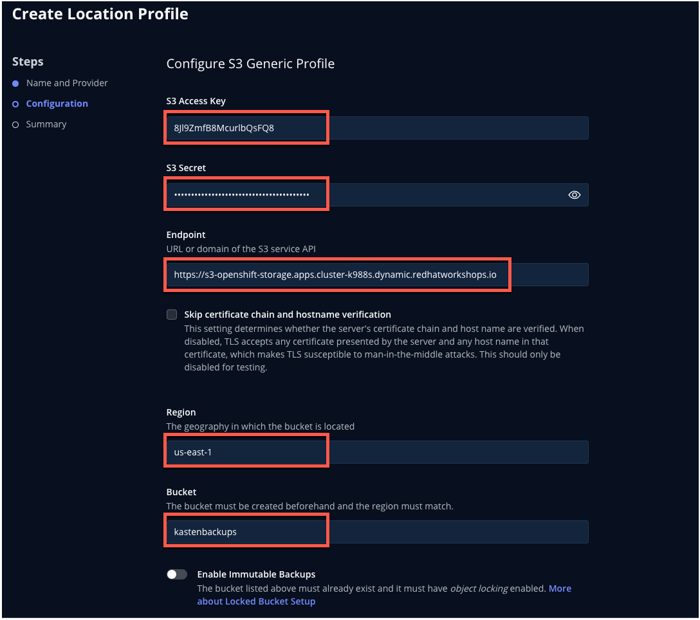

# Configuring Location Profiles

## 1. Introduction

You've now configured everything required to perform a local snapshot of a Kubernetes application using Kasten - *but snapshots are not backup!* In order to restore in the event the local cluster or primary storage is compromised, a copy of that data should be exported to another location.

The configuration of these backup targets are called ***Location Profiles***. Kasten [supports several options](https://docs.kasten.io/latest/usage/configuration.html), including:
  - AWS S3
  - Azure Blob
  - Google Cloud Storage
  - S3-Compatible
  - NFS
  - Veeam Backup & Recovery

Kasten supports the creation of immutable backups to ensure that, as a last line of defense against ransomware, backup data cannot be manipulated or deleted by any user. These backups are supported on the following platforms:
  - AWS S3
  - S3-Compatible with Object Lock support (ex. Ceph, MinIO, Wasabi, etc.)
  - Azure Blob

---

*In this exercise, you will configure an immutable bucket using the on-cluster Ceph Object Gateway deployment and add the bucket as a Location Profile in Kasten.*

> [!CAUTION]
>
> In a real world environment you should never back up data to the same infrastructure you are intending to protect - using on-cluster storage as a backup target is performed in the lab solely to simplify lab staging and instructions. 

## 2. Configuring Immutable Ceph Object Gateway Bucket

1. In your local terminal, connect to the environment using your ***Red Hat Demo Platform*** environment details:

    ```bash
    ssh lab-user@YOUR-LAB-IP-OR-FQDN
    ```

    Or use the `SSH Terminal` session built into your ***Showroom*** lab guide as shown below:

    

1. From the `[lab-user@hypervisor ~]$` prompt, connect to your bastion host for CLI access:

    ```bash
    sudo ssh root@192.168.123.100
    ```

1. From the `[root@ocp4-bastion ~]#` prompt, create an externally accessible Route for the ODF `rook-ceph-rgw-ocs-storagecluster-cephobjectstore` Service:

    ```bash
    cat <<EOF | oc create -f - 
    kind: Route
    apiVersion: route.openshift.io/v1
    metadata:
      name: s3-route
      namespace: openshift-storage
    spec:
      to:
        kind: Service
        name: rook-ceph-rgw-ocs-storagecluster-cephobjectstore
      tls:
        termination: reencrypt
        insecureEdgeTerminationPolicy: Redirect
      port:
        targetPort: https
    EOF

    export CEPH_S3_ENDPOINT="https://$(oc get route \
      s3-route -n openshift-storage -o jsonpath='{.spec.host}')"

    echo $CEPH_S3_ENDPOINT
    ```

    This will be used by Kasten to access the S3 bucket to export and restore backup data.

1. Install the `aws` CLI tool:

    ```bash
    sudo yum install awscli -y
    ```

2. Configure credentials used by `aws` CLI tool to connect to the on-cluster Ceph Object Gateway deployment:

    ```bash
    export AWS_ACCESS_KEY_ID=$(oc get secret \
      rook-ceph-object-user-ocs-storagecluster-cephobjectstore-ocs-storagecluster-cephobjectstoreuser \
      -n openshift-storage -o jsonpath='{.data.AccessKey}' | base64 --decode)

    export AWS_SECRET_ACCESS_KEY=$(oc get secret \
      rook-ceph-object-user-ocs-storagecluster-cephobjectstore-ocs-storagecluster-cephobjectstoreuser \
      -n openshift-storage -o jsonpath='{.data.SecretKey}' | base64 --decode)
    ```

3. Create a bucket named `kasten` with S3 Object Lock enabled, and configure a 5 day default object retention policy:

    ```bash
    aws --endpoint=${CEPH_S3_ENDPOINT} s3api create-bucket \
      --bucket kasten --object-lock-enabled-for-bucket

    aws --endpoint=${CEPH_S3_ENDPOINT} s3api put-object-lock-configuration \
      --bucket kasten \
      --object-lock-configuration '{ "ObjectLockEnabled": "Enabled", "Rule": { "DefaultRetention": { "Mode": "COMPLIANCE", "Days": 5 }}}'
    ```

    S3 Versioning & Object Locking are the mechanisms by which S3-compatible storage ensures that objects cannot be changed or deleted during the compliance period. Kasten integrates with these capabilities to automatically monitor and extend object lock metadata on objects within the Kasten backup repository, according to each application's retention requirements.

4. Save the values that will be used to configure your Kasten Location Profile in the next lab section:

    ```bash
    printf '%s\n' 'ACCESS KEY:' ${AWS_ACCESS_KEY_ID} 'SECRET KEY:' ${AWS_SECRET_ACCESS_KEY} 'ENDPOINT:' ${CEPH_S3_ENDPOINT}
    ```

## 3. Creating an S3-Compatible Location Profile

1. In the ***Kasten Dashboard***, select ***Profiles → Location*** from the sidebar and click ***+ Add New***.

    

1. Fill out the following fields and click ***Next***:

    |  |  |
    |---|---|
    | ***Location Profile Name*** | `ceph-rgw-immutable` |
    | ***Storage Provider*** | S3 Compatible |

    

1. Fill out the following fields ***but DO NOT click Next yet!***:

    |  |  |
    |---|---|
    | ***S3 Access Key*** | Paste `ACCESS KEY` value |
    | ***S3 Secret*** | Paste `SECRET KEY` value |
    | ***Endpoint*** | Paste `ENDPOINT` value |
    | ***Region*** | `us-east-1` |
    | ***Bucket*** | `kasten` |

    

1. Select ***Enable Immutable Backups*** and click the ***Validate Bucket*** button.

    

    You should expect for all checks to pass, as shown. If you encounter errors, verify your ***Endpoint***, ***Access***, ***Secret***, and ***Bucket*** values are correct before attempting to validate again.

1. Drag the ***Protection Period*** slider to set how far into the past you want to be able to access immutable backup data.

1. Click ***Next → Save Profile***.

    You should expect your `ceph-rgw-immutable` Location Profile to appear with a ***Success*** status.

    

    Now you're ready to start protecting apps!

1. Click the ***...*** menu and select ***View YAML*** to view the manifest generated by creating a Location Profile through the Dashboard.

    

    As you can see from this example, Kasten Location Profiles can be created declaratively as a `profile.config.kio.kasten.io` object referencing a Secret to store access and secret keys. This Kubernetes-native implementation makes it simple to configure backup targets using a GitOps approach.

    > [!NOTE]
    >
    > See [docs.kasten.io](https://docs.kasten.io/latest/api/profiles.html) for complete documentation on defining Profile API objects.

1. Click ***Cancel*** or the ***X*** in the upper-right to close the YAML window.