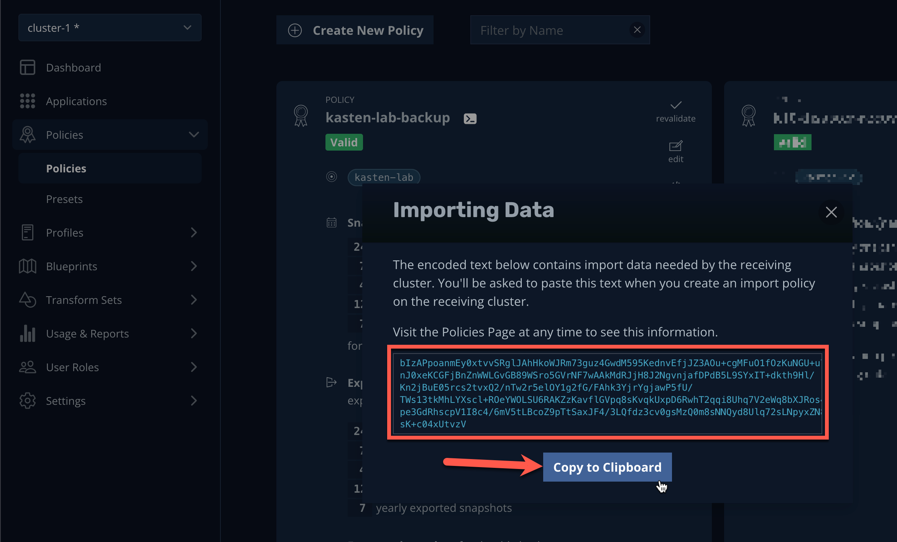
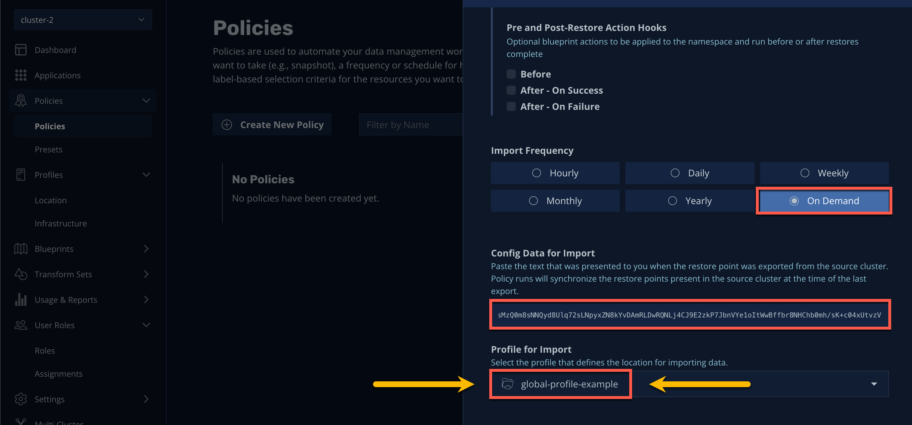
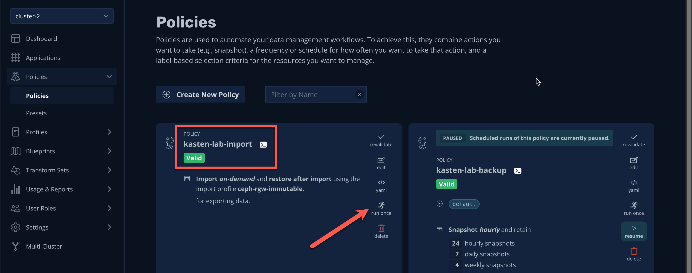

# App Mobility

## 1. Introduction

In this exercise...

> [!IMPORTANT]
>
> This exercise should be completed by the `cluster-1` user ***ONLY***.

## 2. Creating an Import Policy

1. In the ***Kasten Dashboard***, select `cluster-1` from the multi-cluster dropdown menu and select ***Policies → Policies*** from the sidebar.

1. Under your `kasten-lab-backup` Policy, click ***Show import details...***.

    

1. Click ***Copy to Clipboard*** to copy the migration token. Save this value to be used in an upcoming step.

    

1. Select `cluster-2` from the multi-cluster dropdown menu and select ***Policies → Policies*** from the sidebar.

1. Click ***+ New Policy*** and fill out the following fields:

    | | |
    |---|---|
    | ***Name*** | `kasten-lab-import` |
    | ***Action*** | Select ***Import*** |
    | ***Restore After Import*** | Click to enable |
    | ***Import Frequency*** | Select ***On-Demand*** |
    | ***Config Data for Import*** | Paste the migration token |
    | ***Profile for Import*** | Select `global-profile-example` |

    

    

    > [!CRITICAL]
    >
    > Why you need to select `global-profile-example`...

1. Click ***Create Policy***.

1. Under the new `kasten-lab-import` Policy, click ***Run Once → Yes*** to initiate importing `kasten-lab` RestorePoints.

    

1. Return to ***Dashboard*** in the sidebar and select the `kasten-lab-import` Policy Run under ***Actions*** to monitor status.

    

    Once the Import completes, you should observe the Restore action start immediately, using the most recent `kasten-lab` RestorePoint.

1. Once the restore completes, open ***OpenShift Console → Virtualization → Virtual Machines*** on `cluster-2`.
   
    
   
    You should observe the `fedora-k10` VM from `cluster-1` running in the `kasten-lab` namespace (in addition to the `fedora-k10` VM cloned in a previous lab exercise).

## 3. Advanced Options

> *What if you want to automate restoring the most recent backup to a standby cluster for DR or test/dev purposes?*

Simply update the `kasten-lab-import` Policy's frequency from ***On-Demand*** to the desired frequency (e.g. Hourly, Daily, etc.). 

> *What if you need to make changes such as targeting an alternate StorageClass for restore or modifying the Route hostname?*

Kasten provides a robust transformation engine, allowing you to...

Check out the video below to see an example of creating and applying transforms to an application migrating from an on-premises OpenShift cluster to a ROSA cluster:

<iframe width="847" height="476" src="https://www.youtube.com/embed/qocZk5fdxsY" title="Scaling Restore Operations with K10 Transform Sets" frameborder="0" allow="accelerometer; autoplay; clipboard-write; encrypted-media; gyroscope; picture-in-picture; web-share" referrerpolicy="strict-origin-when-cross-origin" allowfullscreen></iframe>

## 4. Takeaways

- Stuff
- and
- Things