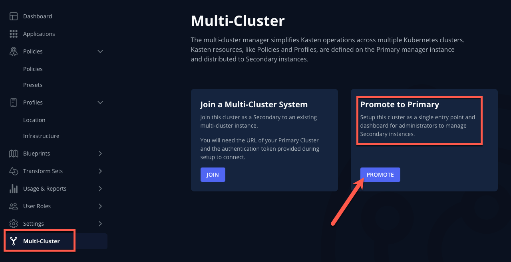
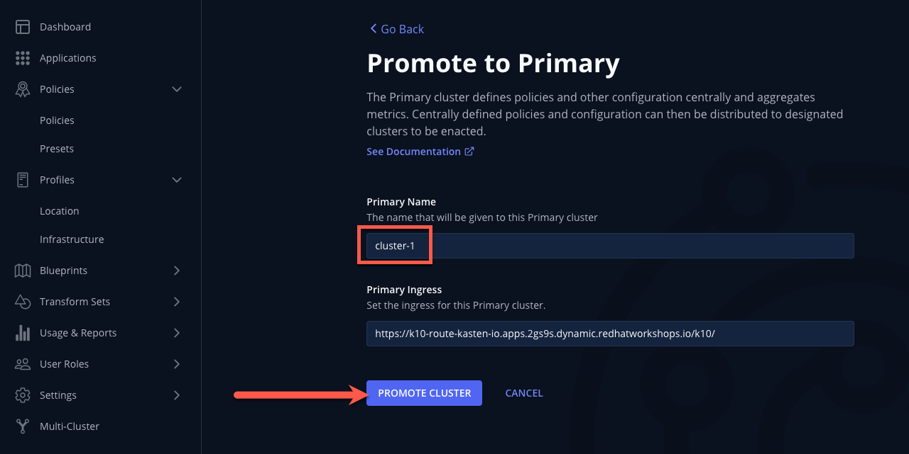
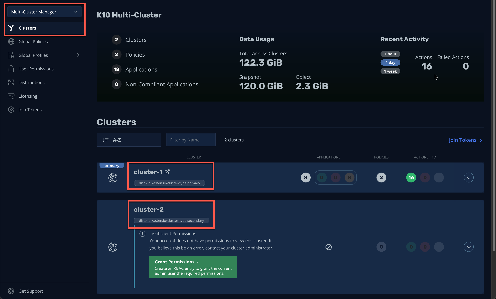
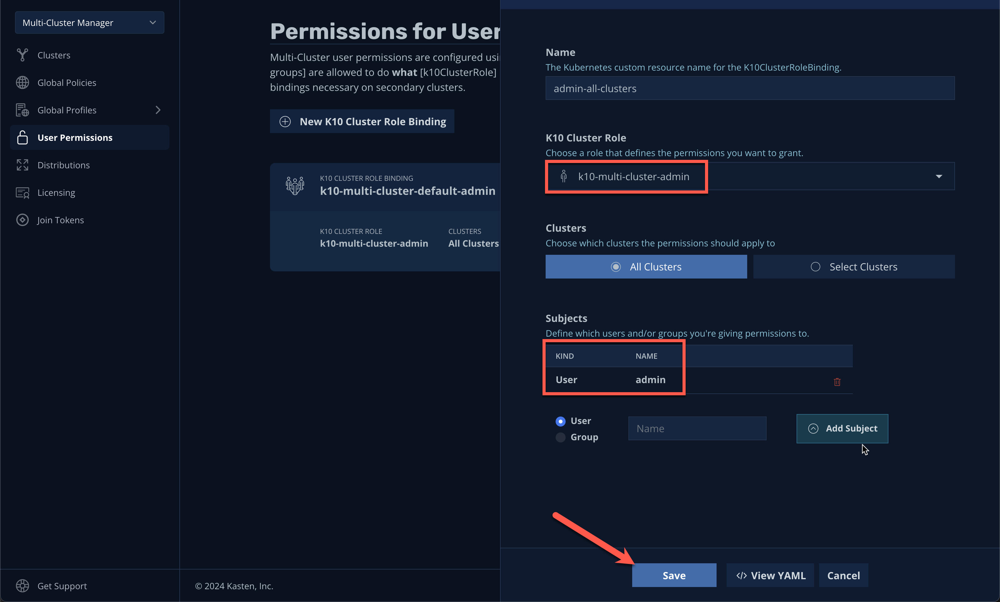
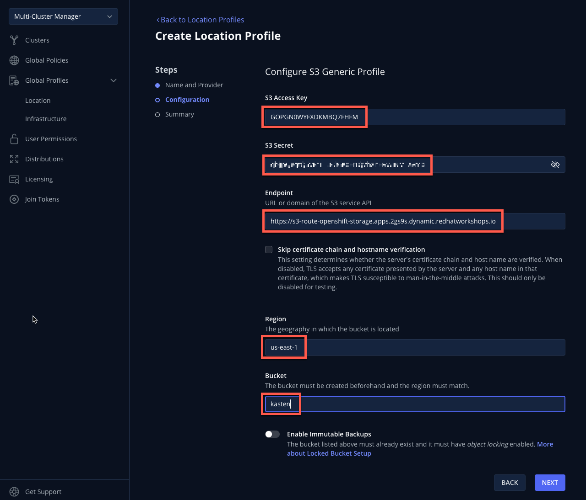
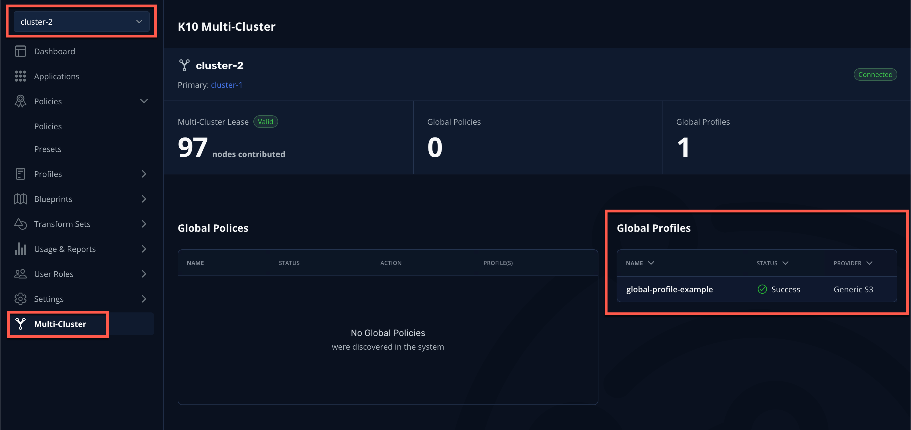

# Kasten Multi-Cluster

## 1. Introduction

In this exercise... this will require working with a partner

## 2. Enable Feature Flag

> [!IMPORTANT]
>
> This section should be completed by ***BOTH*** the `cluster-1` user and `cluster-2` user.

1. In the ***Web Terminal***, run the following to resolve the Kasten Feature Flag URL for your cluster:

    ```bash
    echo "https://$(oc get route k10-route -n kasten-io -o jsonpath='{.spec.host}')/k10/#/features"
    ```

1. Open the URL in your browser and enable ***Join from Secondary*** as shown.

    

1. When prompted, click ***Refresh***.

## 3. Configuring Primary Cluster

> [!IMPORTANT]
>
> This section should be completed by the `cluster-1` user ***ONLY***.

1. In the ***Kasten Dashboard***, select ***Multi-Cluster*** from the sidebar.

1. Under ***Promote to Primary***, click ***Setup***.

    

1. Specify `cluster-1` as the ***Primary Name*** and click ***Setup → Confirm***.

    

    After setup completes, you should see the ***Multi-cluster Manager*** view.

    

    > [!NOTE]
    >
    > A Kasten cluster can also be promoted to the primary cluster role declaratively using Helm/Operand parameters. See [docs.kasten.io](https://docs.kasten.io/latest/multicluster/tutorials/getting_started.html#setting-up-the-primary-cluster-using-helm) for details.

1. Select ***Join Tokens*** from the sidebar and click ***+ Create New Join Token***.

    

1. Specify `lab-token` as the ***Name*** and click ***Confirm***.

    

    > [!NOTE]
    >
    > Join Tokens are a type of Kubernetes Secret that can be created declaratively. See [docs.kasten.io](https://docs.kasten.io/latest/multicluster/tutorials/getting_started.html#join-tokens) for examples.
    >
    > A single token can be used for multiple clusters. Deleting tokens has no impact on clusters that have already joined multi-cluster, but will prevent additional clusters from joining using the deleted token.

2. Click ***Copy*** to copy the token value to the clipboard and send the value to your `cluster-2` partner via one of the following:

    - Slack
    - Slowly reading it aloud 😡
    - Carrier pigeon 🪶
    - Writing it down on a Post-It and burning it after use 🤷‍♂️
    - Probably stick with Slack 👍

1. Click ***Done***.

## 4. Joining Multi-Cluster from Secondary

> [!IMPORTANT]
>
> This section should be completed by the `cluster-2` user ***ONLY***.

1. In the ***Kasten Dashboard***, select ***Multi-Cluster*** from the sidebar.

1. Under ***Join a Multi-Cluster System***, click ***Join***.

    

1. Paste the `lab-token` value from the primary cluster into the ***Token*** field.

    > [!NOTE]
    >
    > The join token also encodes the Kasten ingress URL required for a secondary to reach the primary cluster. If an alternate URL is required in a production environment, this value can be overridden as seen in the UI.

1. Specify `cluster-2` as the ***Local Cluster Name*** and click ***Use Current*** to populate ***Local Cluster Ingress*** with the current Kasten Route value.

    

1. Click ***Connect → Yes*** to join `cluster-2`.

    After a few moments you should observe the Multi-Cluster status page indicating the cluster has been connected to `cluster-1` as a primary.

    

    > [!TIP]
    >
    > Docs ref for GitOps style setup...

## 5. Managing Global Resources

> [!IMPORTANT]
>
> This section should be completed by the `cluster-1` user ***ONLY***.

1. In the `cluster-1` ***Kasten Dashboard***, select ***Multi-Cluster Manager*** from the dropdown menu and validate the ***Clusters*** page now displays both clusters.

    

1. Click the ***Grant Permissions*** button to configure permissions for the current ***Kasten Dashboard*** user.

    This will pre-fill a form to extend the `k10-multi-cluster-admin` ClusterRole to the current user for all current and future Kasten clusters.

    

    > [!NOTE]
    > 
    > In a production environment this can be modified...

1. Keep the default settings and click ***Save***.

1. Select ***Clusters*** from the sidebar and click into `cluster-2` to validate it is accessible. The sidebar dropdown menu can be used to browse between available clusters and the ***Multi-Cluster Manager***.

    

1. In the ***Web Terminal***, run the following to fetch your existing Ceph Object Gateway bucket details:

    ```bash
    export CEPH_S3_ENDPOINT="https://$(oc get route \
      s3-route -n openshift-storage -o jsonpath='{.spec.host}')"
    export AWS_ACCESS_KEY_ID=$(oc get secret \
      rook-ceph-object-user-ocs-storagecluster-cephobjectstore-ocs-storagecluster-cephobjectstoreuser \
      -n openshift-storage -o jsonpath='{.data.AccessKey}' | base64 --decode)
    export AWS_SECRET_ACCESS_KEY=$(oc get secret \
      rook-ceph-object-user-ocs-storagecluster-cephobjectstore-ocs-storagecluster-cephobjectstoreuser \
      -n openshift-storage -o jsonpath='{.data.SecretKey}' | base64 --decode)

    printf '%s\n' 'ACCESS KEY:' ${AWS_ACCESS_KEY_ID} 'SECRET KEY:' ${AWS_SECRET_ACCESS_KEY} 'ENDPOINT:' ${CEPH_S3_ENDPOINT}
    ```

1. In ***Kasten Multi-Cluster Manager***, select ***Global Profiles → Location*** from the sidebar and click ***+ New Profile***

    

1. Fill out the following fields and click ***Save***:

    |  |  |
    |---|---|
    | ***Profile Name*** | `global-profile-example` |
    | ***Storage Provider*** | S3 Compatible |
    | ***S3 Access Key*** | Paste `ACCESS KEY` value |
    | ***S3 Secret*** | Paste `SECRET KEY` value |
    | ***Endpoint*** | Paste `ENDPOINT` value |
    | ***Region*** | `us-east-1` |
    | ***Bucket*** | `kasten` |

    

1. Select ***Distributions*** from the sidebar and click ***+ New Distribution***.

    Distributions allow...

1. Fill out the following fields:

    |  |  |
    |---|---|
    | ***Name*** | `example-distribution` |
    | ***Clusters*** | Select `dist.kio.kasten.io/cluster-type:primary` |
    | | Select `dist.kio.kasten.io/cluster-type:primary` |
    | ***Resources*** | Select `global-profile-example` |

    

    This configuration will ensure the `global-profile-example` Location Profile is synced to all current and future Kasten clusters. 

1. Click ***Add Distribution***.

    You should observe that the distribution has been synced to the selected clusters.

    

    > [!TIP]
    >
    > You can view a summary of global resources for each cluster from the ***Multi-Cluster*** status page as shown below.
    >
    > 

## 6. Takeaways

- Stuff
- And
- Things